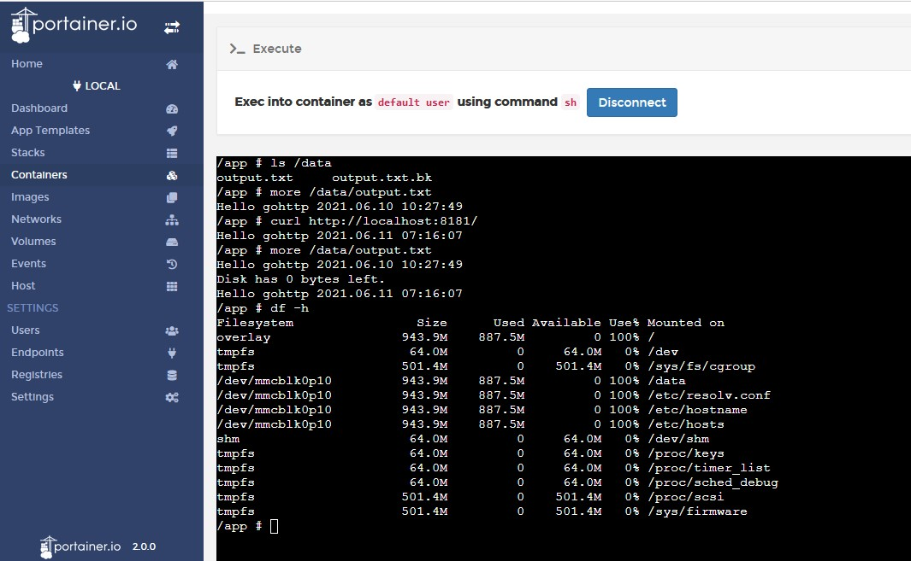
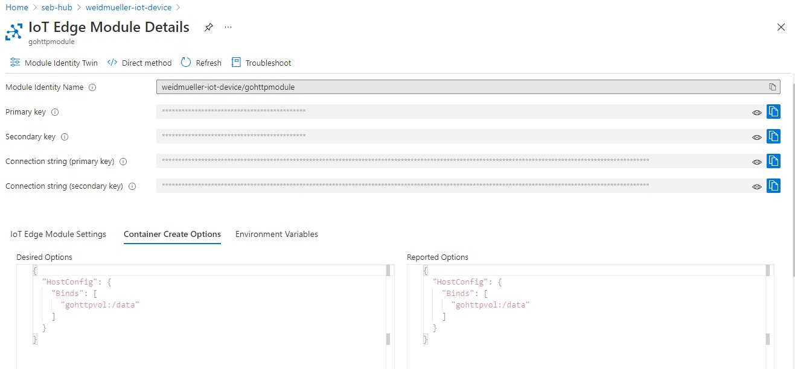

# gohttpmodule
This demonstrates a small lightweight Go HTTP server providing APIs for local internal apps in same device.  
It also shows its potential to provide app reliability, as a small watchdog to pre-empt local apps failure caused by insufficient system resources (e.g. disk space).  

This example Go app checks free disk space left in docker volume. This can potentially prevent imminent app death caused by out of disk space. Functionality can also be added for it to send resource information to Azure IoT Hub for backend monitoring. e.g. via Azure Event Hub.  

**NOTE**:  
This will not indicate the hardware's flash memory wear and tear or hardware resource corruption. This only helps to prevent our app from dying due to out of disk space.

Screenshot From Portainer - the CURL calls `http://localhost:8181/` and this Go app writes to `output.txt` file the bytes left on our disk volume:  

## Building and Deploying
Before building the app, please do your own `go mod init` and `go mod tidy`.  

Explore and use the appropriate Docker files to deploy to their respective hardware.  

This `gohttpmodule` writes data out to docker volume.  

When testing in local Docker, use the appropriate Docker command line options to create and remove docker volumes. Run the module locally using `docker run <container name>` with docker command line options.  Once you have the module working the way you want it, run `docker inspect <container name>`. This command outputs the module details in JSON format. These JSON format provides the configuration options for Azure IoT Edge Module’s  Container Create Options.  

When using Azure IoT Hub, deploy Azure IoT Edge module using `Container Create Options -> HostConfig {...}`. Sample screenshot below.  
